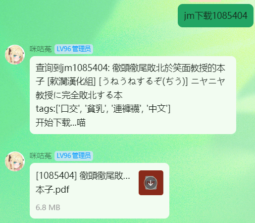

<div align="center">
    <a href="https://v2.nonebot.dev/store">
    </a>

## ✨ *基于 Nonebot2 的 JMComic 插件* ✨

[](./LICENSE)
[](https://www.python.org)
[](#supported-adapters)
<br/>

[](https://github.com/astral-sh/uv)
[](https://github.com/astral-sh/ruff)

</div>

## 📖 介绍

JMComic搜索、下载插件，支持全局屏蔽jm号和tag，支持上传至群聊指定文件夹，仅支持OnebotV11协议。


## 💿 安装

<details open>
<summary>使用 nb-cli 安装</summary>
在 NoneBot2 项目的根目录下打开命令行，输入以下指令即可安装

```bash
nb plugin install nonebot-plugin-jmdownloader --upgrade
```
使用 **pypi** 源安装

```bash
nb plugin install nonebot-plugin-jmdownloader --upgrade -i "https://pypi.org/simple"
```
使用**清华源**安装

```bash
nb plugin install nonebot-plugin-jmdownloader --upgrade -i "https://pypi.tuna.tsinghua.edu.cn/simple"
```
</details>

<details>

<summary>使用包管理器安装</summary>
在 NoneBot2 项目的插件目录下，打开命令行，根据你使用的包管理器，输入相应的安装命令

<details open>
<summary>uv</summary>

```bash
uv add nonebot-plugin-jmdownloader
```
安装仓库 master 分支

```bash
uv add git+https://github.com/Misty02600/nonebot-plugin-jmdownloader@master
```
</details>

<details>
<summary>pdm</summary>

```bash
pdm add nonebot-plugin-jmdownloader
```
安装仓库 master 分支

```bash
pdm add git+https://github.com/Misty02600/nonebot-plugin-jmdownloader@master
```
</details>

<details>
<summary>poetry</summary>

```bash
poetry add nonebot-plugin-jmdownloader
```
安装仓库 master 分支

```bash
poetry add git+https://github.com/Misty02600/nonebot-plugin-jmdownloader@master
```
</details>

打开 NoneBot2 项目根目录下的 `pyproject.toml` 文件，在 `[tool.nonebot]` 部分追加写入

```toml
plugins = ["nonebot_plugin_jmdownloader"]
```

</details>

## ⚙️ 配置

插件使用[nonebot_plugin_localstore](https://github.com/nonebot/plugin-localstore)储存数据和下载缓存。

在 NoneBot2 项目的`.env`文件中添加下表中的必填配置

|           配置项            | 必填  |  默认值   |                   说明                   |
| :-------------------------: | :---: | :-------: | :--------------------------------------: |
|      jmcomic_username       |  否   |    无     |               JM登录用户名               |
|      jmcomic_password       |  否   |    无     |                JM登录密码                |
|       jmcomic_proxies       |  否   |  system   |               网络代理地址               |
|         jmcomic_log         |  否   |   False   | 是否开启JMComic-Crawler-Python的日志输出 |
|    jmcomic_thread_count     |  否   |    10     |               下载线程数量               |
|   jmcomic_group_list_mode   |  否   | blacklist |     群列表模式：blacklist/whitelist      |
|    jmcomic_allow_groups     |  否   |    无     |  已废弃，请使用 jmcomic_group_list_mode  |
|    jmcomic_allow_private    |  否   |   True    |           是否允许私聊使用功能           |
|     jmcomic_user_limits     |  否   |     5     |        每位用户的每周下载限制次数        |
|    jmcomic_output_format    |  否   |    pdf    |           输出格式：pdf 或 zip           |
|    jmcomic_zip_password     |  否   |    无     |    ZIP 压缩包密码（仅 zip 格式有效）     |
|   jmcomic_modify_real_md5   |  否   |   False   | 修改PDF的MD5以避免发送失败（仅PDF有效）  |
|  jmcomic_results_per_page   |  否   |    20     |          每页显示的搜索结果数量          |
| jmcomic_punish_on_violation |  否   |   True    | 群员下载违规内容时是否惩罚（禁言+拉黑）  |

**群列表模式说明：**
- `blacklist`（黑名单模式）：默认禁用所有群，只有显式启用的群才能使用
- `whitelist`（白名单模式）：默认启用所有群，只有显式禁用的群不能使用


**示例：**
```yaml
# 是否启用 JMComic 日志 (True 表示启用, False 表示禁用)
JMCOMIC_LOG=True
# JMComic 代理配置，更多格式参考https://jmcomic.readthedocs.io/zh-cn/latest/option_file_syntax
JMCOMIC_PROXIES=127.0.0.1:10809
# 下载线程数量 (线程越多对性能要求越高，范围 1~50)
JMCOMIC_THREAD_COUNT=10
# JMComic 登录用户名，如果不填则不登录，不登录时部分本子可能会受限
JMCOMIC_USERNAME=******
# JMComic 登录密码
JMCOMIC_PASSWORD=******
# JMComic 群列表模式：blacklist（默认禁用）/ whitelist（默认启用）
JMCOMIC_GROUP_LIST_MODE=blacklist
# [废弃] 旧配置，使用 True = whitelist, False = blacklist
# JMCOMIC_ALLOW_GROUPS=False
# JMComic 是否允许私聊使用功能
JMCOMIC_ALLOW_PRIVATE=True
# JMComic 每位用户的每周下载限制次数
JMCOMIC_USER_LIMITS=5
# JMComic 输出格式：pdf 或 zip
JMCOMIC_OUTPUT_FORMAT=pdf
# JMComic ZIP 压缩包密码（仅 zip 格式有效，留空则不加密）
# JMCOMIC_ZIP_PASSWORD=your_password
# JMComic 是否修改PDF文件的MD5值（增强防和谐但可能增加流量消耗，仅PDF格式有效）
JMCOMIC_MODIFY_REAL_MD5=False
# 每页显示的搜索结果数量，越多每次发送时间越长且越容易被吞，建议40以内
JMCOMIC_RESULTS_PER_PAGE=20
# 群员下载违规内容时是否惩罚（禁言+拉黑）
JMCOMIC_PUNISH_ON_VIOLATION=True
```

> [!IMPORTANT]
> `JMCOMIC_ALLOW_GROUPS` 配置项会自动转换为新配置：
> - `JMCOMIC_ALLOW_GROUPS=True` → `JMCOMIC_GROUP_LIST_MODE=whitelist`
> - `JMCOMIC_ALLOW_GROUPS=False` → `JMCOMIC_GROUP_LIST_MODE=blacklist`
>
> 如果同时设置了两个配置，新配置 `JMCOMIC_GROUP_LIST_MODE` 的优先级更高。

> [!IMPORTANT]
> `JMCOMIC_BLOCKED_MESSAGE` 配置项已在新版本中移除，现在会读取nickname发送屏蔽本子的代替消息

## 🎉 使用
### 指令表
|          指令           |   权限   | 需要@ |   范围    |                         说明                         |
| :---------------------: | :------: | :---: | :-------: | :--------------------------------------------------: |
|       jm下载 [id]       |   群员   |  否   | 群聊/私聊 |        下载指定的 JMComic 本子到群文件或私聊         |
|       jm查询 [id]       |   群员   |  否   | 群聊/私聊 |             查询指定的 JMComic 本子信息              |
|     jm搜索 [关键词]     |   群员   |  否   | 群聊/私聊 |          搜索 JMComic 网站的漫画并返回列表           |
|        jm下一页         |   群员   |  否   | 群聊/私聊 |                 显示搜索结果的下一页                 |
| jm设置文件夹 [文件夹名] |  管理员  |  否   |   群聊    |              设置群聊内本子的上传文件夹              |
|     jm拉黑 [@用户]      |  管理员  |  否   |   群聊    |               将用户加入当前群的黑名单               |
|   jm解除拉黑 [@用户]    |  管理员  |  否   |   群聊    |               将用户移出当前群的黑名单               |
|        jm黑名单         |  管理员  |  否   |   群聊    |                列出当前群的黑名单列表                |
|     jm启用群 [群号]     | 超级用户 |  否   | 群聊/私聊 | 启用指定群的插件功能，可用空格隔开多个群号，以下同理 |
|     jm禁用群 [群号]     | 超级用户 |  否   | 群聊/私聊 |                 禁用指定群的插件功能                 |
|         开启jm          | 超级用户 |  否   |   群聊    |                  启用本群的插件功能                  |
|         关闭jm          |  管理员  |  否   |   群聊    |   禁用本群的插件功能，管理员和群主**只能关不能开**   |
|      jm禁用id [id]      | 超级用户 |  否   | 群聊/私聊 | 禁止指定jm号的本子下载，可用空格隔开多个id，以下同理 |
|     jm禁用tag [tag]     | 超级用户 |  否   | 群聊/私聊 |              禁止带有指定tag的本子下载               |

- 设置文件夹需要协议端API支持，bot会先读取群内是否有该文件夹，如果没有会尝试创建。
- Bot会在每天凌晨3点清理缓存文件夹。
- 被屏蔽的本子会在搜索结果中隐藏，下载被屏蔽的本子会被阻止下载。
- 普通用户下载违规内容时，默认会被禁言24小时并加入本群黑名单（可通过 `JMCOMIC_PUNISH_ON_VIOLATION` 配置关闭）。
- **超管、群管理员、群主下载违规内容时只会被阻止，不会被惩罚。**
- **命令需要添加 COMMAND_START 前缀**

### 🎨 效果图




## ⚠️ 使用警告

**仅作为交流学习使用！请严格遵守法律法规与公序良俗！**

❌ 禁止将本插件用于任何非法用途

❌ 禁止分享/传播未成年人相关或违法内容


本插件仅限**个人合规使用**，用户行为责任自负，开发者不承担任何连带责任。

## 📃 许可证

本项目采用 [MIT](./LICENSE) 许可证。

## 🙏 致谢

[JMComic-Crawler-Python](https://github.com/hect0x7/JMComic-Crawler-Python)提供的API
