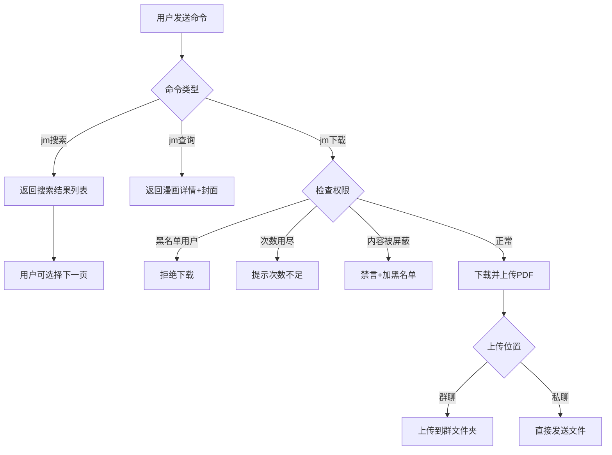
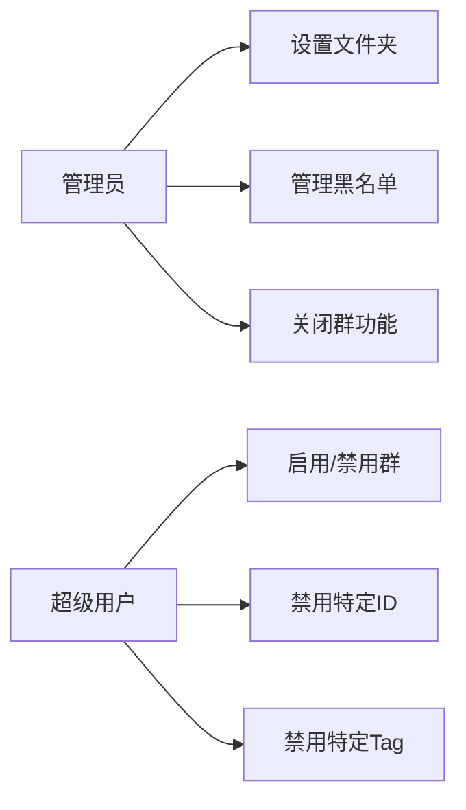

# Product Context

## 项目存在的原因
JMComic 是一个流行的漫画网站，但直接访问可能存在网络限制或不便。本插件通过集成到 QQ 机器人中，让用户能够方便地通过聊天命令搜索和下载漫画，无需直接访问网站。

## 解决的问题
1. **访问便捷性**: 用户无需打开浏览器，直接在 QQ 中即可完成漫画搜索和下载
2. **文件分享**: 下载的漫画可以直接上传到群文件，方便群友获取
3. **内容管理**: 提供完善的内容过滤机制，避免不当内容传播
4. **使用限制**: 通过下载次数限制，避免资源滥用

## 工作方式

### 用户交互流程

### 管理流程

## 用户体验目标

### 普通用户
- **简单直观**: 命令格式简洁，如 `jm下载 123456`
- **信息丰富**: 搜索和查询结果包含封面、作者、标签等信息
- **反馈及时**: 下载过程有状态提示，成功后直接获得文件

### 群管理员
- **权限清晰**: 可管理黑名单，可关闭群功能
- **易于配置**: 可自定义文件上传目录

### 机器人管理员
- **灵活配置**: 支持代理、线程数、下载限制等多项配置
- **安全可控**: 可全局禁用特定内容，保护社区安全

## 差异化特点
1. **内容过滤完善**: 预置敏感标签过滤，自动惩罚违规用户
2. **群文件集成**: 支持直接上传到指定群文件夹
3. **资源控制**: 用户每周下载次数限制，防止滥用
4. **MD5 修改**: 可选开启 PDF MD5 修改，避免重复文件发送失败
