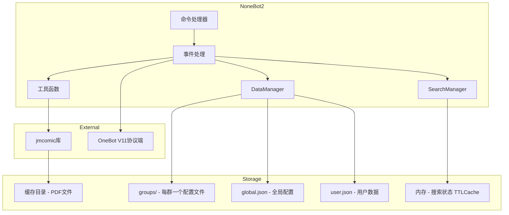
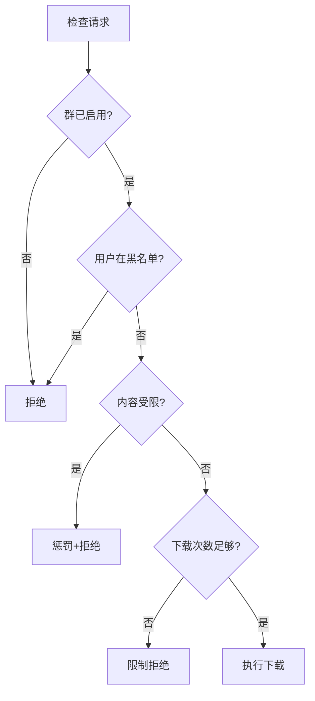

# System Patterns

## 目录

- [系统架构](#系统架构)
- [Service 设计模式](#service-设计模式)
- [核心模块](#核心模块)
- [数据管理架构](#数据管理架构)
  - [存储结构](#存储结构)
  - [数据模型 (models.py)](#数据模型-modelspy)
  - [数据管理器 (data_manager.py)](#数据管理器-data_managerpy)
  - [JSON 存储格式](#json-存储格式)
  - [enabled 字段语义](#enabled-字段语义)
  - [ID 类型规范](#id-类型规范)
- [搜索与分页机制](#搜索与分页机制)
- [权限控制模式](#权限控制模式)
- [组件关系](#组件关系)
- [外部依赖](#外部依赖)

---

## 系统架构



---

## Service 设计模式

Service 层（应用服务层）负责业务流程编排。以下是两种常见的设计模式：

### 方案 A：Send 回调模式

Service 接收一个 send 回调函数，用于发送消息。适合需要**流式反馈**的场景。

```python
# 定义回调类型
SendCallback = Callable[[str], Awaitable[None]]

# Service
async def process_download(
    photo_id: str,
    send: SendCallback,  # 回调函数
    ...
) -> DownloadResult:
    await send("正在下载...")
    # 执行业务逻辑
    await send("下载完成")
    return DownloadResult(success=True)

# Handler
async def handler(bot: Bot, event: Event):
    async def send_msg(msg: str):
        await bot.send(event, msg)

    result = await service.process_download(photo_id, send=send_msg)
```

**优点**：适合多步骤反馈
**缺点**：需要 mock 回调进行测试

---

### 方案 B：返回结果模式 ✅ (当前采用)

Service 只返回结果数据，由 Handler 负责发送消息。**解耦更好，易于测试。**

```python
# 结果数据类
@dataclass
class DownloadResult:
    success: bool
    error_message: str | None = None
    progress_message: str | None = None
    pdf_path: str | None = None

# Service（纯业务逻辑，无 NoneBot 依赖）
async def process_download(photo_id: str, ...) -> DownloadResult:
    if not photo_id:
        return DownloadResult(success=False, error_message="请输入jm号")
    # 执行业务逻辑...
    return DownloadResult(success=True, pdf_path=path)

# Handler（接口层，负责发送消息）
async def handler(bot: Bot, event: Event):
    result = await service.process_download(photo_id)

    if not result.success:
        await matcher.finish(result.error_message)

    await matcher.send(result.progress_message)
    # 上传文件...
```

**优点**：
- Service 可独立测试（断言返回值）
- 更好的关注点分离
- Handler 保持简洁

**缺点**：
- 多步骤反馈需要返回结构体包含多个消息

---

### 选择建议

| 场景                         | 推荐方案 |
| ---------------------------- | -------- |
| 简单操作（黑名单、权限检查） | 方案 B   |
| 复杂操作（下载、查询、搜索） | 方案 B   |
| 需要实时流式反馈             | 方案 A   |

**本项目统一采用方案 B。**

## 核心模块

### 分层架构

```
src/nonebot_plugin_jmdownloader/
├── __init__.py              # 插件入口，注册命令
├── config.py                # Pydantic 配置模型
├── migration.py             # 旧数据迁移
│
├── core/                    # 核心领域层（无 NoneBot 依赖）
│   ├── models.py            # 数据模型定义
│   ├── restriction.py       # 限制规则检查
│   └── session.py           # 搜索会话管理
│
├── infra/                   # 基础设施层
│   ├── jm_service.py        # JMService - JMComic API 封装 + format_photo_info
│   ├── data_manager.py      # DataManager - 数据持久化
│   ├── pdf_utils.py         # PDF 处理工具
│   └── image_utils.py       # 图片处理工具
│
└── bot/                     # Bot 层
    ├── __init__.py          # 统一导出（GroupRule, jm_service, data_manager, sessions）
    ├── service.py           # 服务实例化
    ├── nonebot_utils.py     # 通用工具函数（send_forward_msg, parse_numeric_*）
    │
    └── handlers/            # 命令处理器（接口层）
        ├── dependencies.py      # 参数解析依赖 + GroupRule
        ├── common_handlers.py   # 前置检查 handler
        ├── download.py          # jm下载
        ├── query.py             # jm查询
        ├── search.py            # jm搜索、jm下一页
        ├── blacklist.py         # 黑名单管理
        ├── group_control.py     # 群功能控制
        ├── ban_id_tag.py        # 内容过滤
        └── scheduled.py         # 定时任务
```

### 模块职责

| 层级      | 模块                        | 职责                                 |
| --------- | --------------------------- | ------------------------------------ |
| **core**  | models.py                   | msgspec 数据结构定义                 |
| **core**  | restriction.py              | 限制规则检查（ID/标签/次数）         |
| **core**  | session.py                  | 搜索会话管理（TTLCache）             |
| **infra** | jm_service.py               | JMComic API 封装 + format_photo_info |
| **infra** | data_manager.py             | 数据持久化 + 原子写入                |
| **bot**   | service.py                  | 服务实例化                           |
| **bot**   | nonebot_utils.py            | 通用工具函数                         |
| **bot**   | handlers/dependencies.py    | 参数解析依赖 + GroupRule             |
| **bot**   | handlers/common_handlers.py | 前置检查 handler                     |
| **bot**   | handlers/*.py               | 命令处理器（接口层）                 |


---

## 数据管理架构

### 存储结构

每个群一个配置文件，实现配置隔离：

```
data/  (由 nonebot_plugin_localstore 管理)
├── groups/               # 每个群一个配置文件
│   ├── 123456789.json    # 群 123456789 的配置
│   ├── 987654321.json    # 群 987654321 的配置
│   └── ...
├── global.json           # 全局配置（受限标签/ID、禁止本子）
└── user.json             # 用户数据（下载次数）
```

**好处**：
- 单群数据损坏不影响其他群
- 更容易备份和管理单个群的配置
- 删除群配置更简单（删除文件即可）
- 减少单文件体积

### 数据模型 (models.py)

使用 **msgspec.Struct** 实现类型安全的数据模型，配合 **`omit_defaults=True`** 省略未修改的字段。

#### GroupConfig - 单群配置

存储于 `groups/<group_id>.json`

```python
class GroupConfig(msgspec.Struct, omit_defaults=True):
    """单个群的配置数据"""

    folder_id: str | None = None          # 群文件夹 ID
    enabled: bool | msgspec.UnsetType = msgspec.UNSET  # 启用状态
    blacklist: list[str] = msgspec.field(default_factory=list)

    # 业务方法
    def is_enabled(self, default: bool = False) -> bool: ...
    def add_to_blacklist(self, user_id: str) -> bool: ...
    def remove_from_blacklist(self, user_id: str) -> bool: ...
    def is_blacklisted(self, user_id: str) -> bool: ...
```

#### GlobalConfig - 全局配置

存储于 `global.json`

```python
class GlobalConfig(msgspec.Struct, omit_defaults=True):
    """全局配置数据"""

    # 类常量：预置安全过滤
    DEFAULT_RESTRICTED_TAGS: ClassVar[list[str]] = ["獵奇", "重口", "YAOI", ...]
    DEFAULT_RESTRICTED_IDS: ClassVar[list[str]] = ["136494", "323666", ...]

    # 字段
    restricted_tags: list[str] = msgspec.field(default_factory=list)
    restricted_ids: list[str] = msgspec.field(default_factory=list)
    forbidden_albums: list[str] = msgspec.field(default_factory=list)

    # 业务方法
    def ensure_defaults(self) -> bool: ...
    def add_restricted_tag(self, tag: str) -> bool: ...
    def is_tag_restricted(self, tag: str) -> bool: ...
    def has_restricted_tag(self, tags: Iterable[str]) -> bool: ...
    # ... 更多受限内容/禁止本子操作方法
```

#### UserData - 用户数据

存储于 `user.json`

```python
class UserData(msgspec.Struct, omit_defaults=True):
    """用户数据"""

    user_limits: dict[str, int] = msgspec.field(default_factory=dict)  # key = user_id

    # 业务方法
    def get_user_limit(self, user_id: str, default: int = 5) -> int: ...
    def set_user_limit(self, user_id: str, limit: int) -> None: ...
    def try_consume_limit(self, user_id: str, default: int = 5) -> bool: ...
    def reset_all_user_limits(self, limit: int) -> int: ...
```

### 数据管理器 (data_manager.py)

**DataManager** 负责：
1. **加载/保存**：使用 `msgspec.json` 序列化 + `boltons.atomic_save` 原子写入
2. **群配置缓存**：避免频繁读取文件
3. **数据迁移**：自动检测并迁移旧格式
4. **代理方法**：调用 `models.py` 的业务方法 + 自动保存

```python
class DataManager:
    def __init__(self, ...):
        self._groups_dir: Path           # groups/ 目录
        self._group_cache: dict[str, GroupConfig]  # 群配置缓存
        self.global_config: GlobalConfig  # 全局配置
        self.users: UserData              # 用户数据
        self.default_enabled: bool        # 来自 jmcomic_allow_groups 配置
        self.default_user_limit: int      # 来自 jmcomic_user_limits 配置

    def get_group(self, group_id: str) -> GroupConfig:
        """获取群配置（带缓存）"""
        if group_id not in self._group_cache:
            self._group_cache[group_id] = self._load_group(group_id)
        return self._group_cache[group_id]

    def save_group(self, group_id: str) -> None:
        """保存群配置到文件"""
        ...
```

#### 单例模式

```python
# 延迟初始化单例
from .data_manager import data_manager, search_manager

# 使用
data_manager.is_group_enabled(str(event.group_id))
```

### JSON 存储格式

#### groups/<group_id>.json

```json
{
    "folder_id": "/群文件夹ID",
    "enabled": true,
    "blacklist": ["111111", "222222"]
}
```

#### global.json

```json
{
    "restricted_tags": ["獵奇", "重口", "YAOI", ...],
    "restricted_ids": ["136494", "323666", ...],
    "forbidden_albums": ["12345"]
}
```

#### user.json

```json
{
    "user_limits": {
        "123456789": 5,
        "987654321": 3
    }
}
```

### enabled 字段语义

使用 **msgspec.UNSET** 实现三态语义：

| 值              | JSON 表现          | 语义           | 来源                   |
| --------------- | ------------------ | -------------- | ---------------------- |
| `msgspec.UNSET` | 字段不存在         | 使用配置默认值 | `jmcomic_allow_groups` |
| `True`          | `"enabled": true`  | 显式启用       | 管理员执行 `jm开启`    |
| `False`         | `"enabled": false` | 显式禁用       | 管理员执行 `jm关闭`    |

### ID 类型规范

**统一使用 `str` 类型**：
- `group_id`: `str`（群号）
- `user_id`: `str`（用户 QQ 号）
- `album_id` / `jm_id`: `str`（本子 ID）

调用点需要显式转换：
```python
data_manager.is_group_enabled(str(event.group_id))
data_manager.get_user_limit(str(event.user_id))
```

---

## 搜索与分页机制

### 双层分页设计

| 层级           | 分页大小 | 说明                               |
| -------------- | -------- | ---------------------------------- |
| **用户展示层** | 20 条/页 | 由 `jmcomic_results_per_page` 配置 |
| **API 请求层** | 80 条/页 | JMComic API 固定返回量             |

### SearchManager（基于 TTLCache）

```python
class SearchManager:
    """搜索状态管理器 - 使用 cachetools.TTLCache 自动处理过期"""

    def __init__(self, ttl_seconds: int = 1800, maxsize: int = 1000):
        self._cache: TTLCache[str, SearchState]

    def get_state(self, user_id: str) -> SearchState | None: ...
    def set_state(self, user_id: str, state: SearchState) -> None: ...
    def remove_state(self, user_id: str) -> None: ...
    def clean_expired(self) -> None: ...
```

---

## 权限控制模式



---

## 组件关系

| 组件              | 依赖                                | 被依赖                 |
| ----------------- | ----------------------------------- | ---------------------- |
| `__init__.py`     | config, data_manager, utils         | -                      |
| `config.py`       | nonebot_plugin_localstore           | __init__, data_manager |
| `models.py`       | msgspec                             | data_manager           |
| `data_manager.py` | models, config, boltons, cachetools | __init__, utils        |
| `utils.py`        | data_manager                        | __init__               |

---

## 外部依赖

| 依赖                           | 用途                          |
| ------------------------------ | ----------------------------- |
| **jmcomic**                    | 漫画 API 和下载               |
| **msgspec**                    | 高性能 JSON 序列化 + 类型安全 |
| **boltons**                    | 原子文件写入 (atomic_save)    |
| **cachetools**                 | TTLCache 自动过期缓存         |
| **nonebot-plugin-localstore**  | 本地存储管理                  |
| **nonebot-plugin-apscheduler** | 定时任务                      |
| **nonebot-plugin-alconna**     | 命令解析                      |
| **nonebot-plugin-waiter**      | 用户交互等待                  |
| **pillow**                     | 图片处理                      |
| **img2pdf**                    | PDF 生成                      |
| **httpx**                      | HTTP 请求                     |
