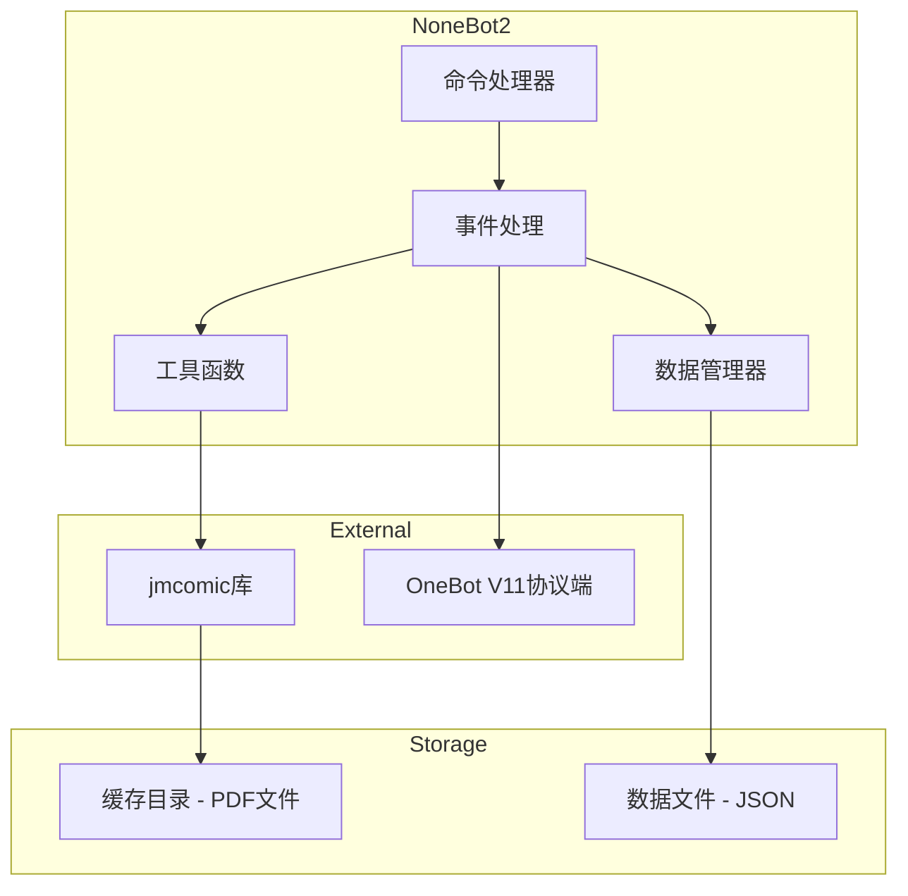
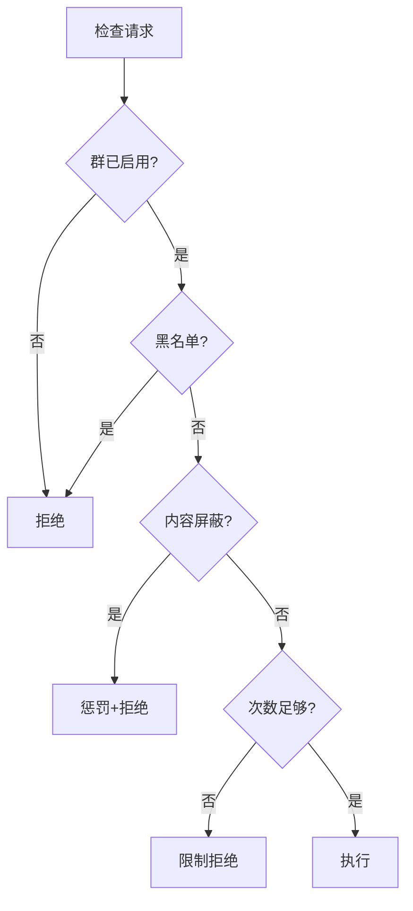

# System Patterns

## 系统架构



## 核心模块

### 1. 命令处理层 (`__init__.py`)
- 使用 `on_command` 注册各类命令
- 负责参数解析和权限检查
- 调用工具函数执行实际操作
- 格式化并返回响应消息

### 2. 数据管理层 (`data_source.py`)
- **JmComicDataManager**: 单例模式管理所有持久化数据
  - 群文件夹配置
  - 用户下载限制
  - 黑名单管理
  - 群功能开关
  - 屏蔽列表（ID/Tag）
- **SearchState/SearchManager**: 管理用户搜索会话状态

### 3. 工具函数层 (`utils.py`)
- API 调用封装（异步化）
- 图片处理（模糊、下载）
- PDF 处理（MD5 修改）
- 权限检查规则
- 消息转发构建

### 4. 配置层 (`config.py`)
- Pydantic 模型定义配置项
- 动态生成 jmcomic 配置字符串
- 管理缓存目录路径

## 关键设计决策

### 1. 异步处理
- 所有 jmcomic 库调用通过 `asyncio.to_thread` 包装
- 避免阻塞 NoneBot2 事件循环
```python
async def get_photo_info_async(client, photo_id):
    return await asyncio.to_thread(get_photo_info, client, photo_id)
```

### 2. 数据持久化
- 使用 `nonebot_plugin_localstore` 管理数据目录
- JSON 格式存储，结构清晰易调试
- 单一数据文件，避免文件碎片

### 3. 权限控制模式


### 4. 搜索会话管理
- 使用 dataclass 存储搜索状态
- 基于用户ID的会话隔离
- 支持分页浏览，超时自动清理

### 5. 内容过滤策略
- 双重过滤: JM号 + 标签
- 预置危险内容列表
- 违规自动惩罚机制（禁言+黑名单）

## 组件关系

| 组件 | 依赖 | 被依赖 |
|------|------|--------|
| `__init__.py` | config, data_source, utils | - |
| `config.py` | nonebot_plugin_localstore | __init__, data_source |
| `data_source.py` | config | __init__, utils |
| `utils.py` | data_source | __init__ |

## 外部依赖

| 依赖 | 用途 |
|------|------|
| jmcomic | 漫画 API 和下载 |
| nonebot-plugin-localstore | 本地存储管理 |
| nonebot-plugin-apscheduler | 定时任务（清理缓存） |
| nonebot-plugin-alconna | 命令解析 |
| nonebot-plugin-waiter | 用户交互等待 |
| nonebot-plugin-uninfo | 会话信息获取 |
| pillow | 图片处理 |
| img2pdf | PDF 生成 |
| httpx | HTTP 请求 |
